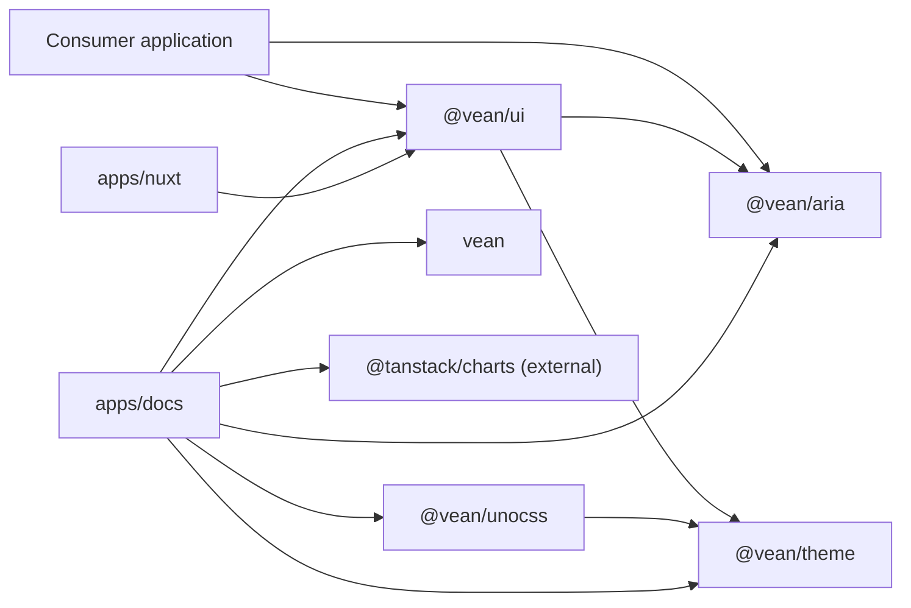
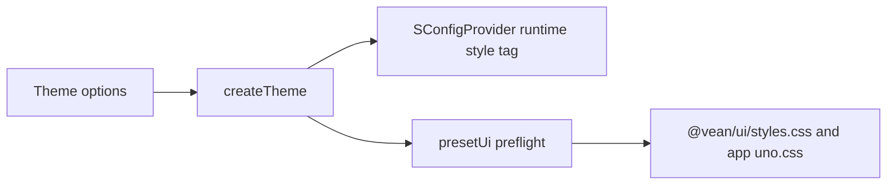
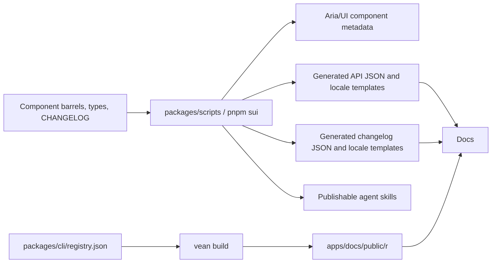

# Vean project architecture

> **Snapshot:** 2026-09-06 · repository version `0.31.0`
>
> This document describes the repository as it exists today. It is the canonical
> workspace-level architecture reference; component implementation rules remain
> in `.agents/skills/vean-ui-develop/`.

## 1. Evidence and scope

The architecture was reconstructed from package manifests, build/test
configuration, public entry points, generated metadata, and a CodeGraph 1.5.0
index.

- CodeGraph index status: up to date.
- Indexed scope: 2,557 files indexed (1,373 Vue, 1,176 TypeScript, plus
  JavaScript and YAML).
- Graph size: 23,434 nodes and 69,383 edges.
- Repository scope: 3,435 tracked files. Markdown, JSON, CSS, assets, and other
  files outside the graph were checked directly.
- Symbol-impact checks confirmed two important high-fanout seams:
  `useUiContext` affects 74 files, while `createTheme` affects 15 files
  across runtime UI and UnoCSS configuration.

Package manifests are the source of truth for declared package dependencies.
CodeGraph is the source used here for symbol relationships and impact analysis;
generic symbol names can be ambiguous, so graph results were cross-checked
against imports and configuration before being documented.

## 2. Repository at a glance

The pnpm workspace contains the private root project plus eleven child
workspaces: seven publishable packages, two private packages, and two private
applications.

| Area                | Workspace           | Purpose                                                                                                                                                                               |
| ------------------- | ------------------- | ------------------------------------------------------------------------------------------------------------------------------------------------------------------------------------- |
| Component logic     | `@vean/aria`        | State, behavior, a11y, focus, keyboard interaction, locale, and unstyled composition                                                                                                  |
| Styled components   | `@vean/ui`          | `S`-prefixed wrappers, UnoCSS recipes, theme-facing props, Nuxt module, and resolver                                                                                                  |
| Theme engine        | `@vean/theme`       | Theme option normalization, CSS-variable generation, dark derivation, SSR/storage                                                                                                     |
| UnoCSS integration  | `@vean/unocss`      | UnoCSS preset, preflights, animations, fonts, and generated theme CSS                                                                                                                 |
| AI conversation UI  | aria + ui (planned) | AI/chat components planned under the standard `S` prefix; see [ui-ai-roadmap.md](ui-ai-roadmap.md)                                                                                    |
| Admin shell domain  | aria + ui (planned) | Shell modes, navigation model, and tabs state in a aria `shell` domain; `SLayoutShell` / `SShellMenu` / `SPageHeader` / `SLogo` in ui; see [ui-shell-roadmap.md](ui-shell-roadmap.md) |
| Source distribution | `vean`              | CLI, registry, schemas, templates, and MCP tools for copy-source delivery                                                                                                             |
| Repo service CLI    | `@vean/scripts`     | PRIVATE; `sui` CLI for metadata, API, changelog, locale, and skill generators                                                                                                         |
| Agent distribution  | `@vean/skills`      | Generated, publishable Vean and Aria agent skills                                                                                                                                     |
| Documentation       | `@vean/docs`        | ubean SSG documentation, API reference, changelog, and interactive demos                                                                                                              |
| Integration fixture | `@vean/nuxt`        | Self-contained minimal Nuxt/UnoCSS integration fixture                                                                                                                                |

There is no admin, chart, or standalone AI package. AI/chat components are
planned to ship inside aria + ui under the standard `S` prefix, with domain
logic in a aria `src/ai/` module (see [ui-ai-roadmap.md](ui-ai-roadmap.md)).
The former admin direction returns as an in-core **shell domain**: shell mode
orchestration, the unified navigation model, and router-agnostic tabs state
land in a aria `src/shell/` module (subpath `/shell`), while composites
ship in ui (see [ui-shell-roadmap.md](ui-shell-roadmap.md)).
Charts are deliberately outside the library: the docs site renders
shadcn-styled demos built directly on
[TanStack Charts](https://tanstack.com/charts), with a docs-local theming shell
(`apps/docs/src/components/chart/`) bridging Vean `--chart-*` tokens.

Current generated component inventory:

- Aria: 96 component directories, of which 94 have public component entry
  points; `_common` and `_icon` are internal. There are 28 reusable composable
  files.
- Styled UI: 96 public component groups and 144 `S`-prefixed exports.
- The generated inventories are
  `packages/aria/src/constants/components.ts` and
  `packages/ui/src/constants/components.ts`; prose counts are secondary.

## 3. Directory organization

```text
vean/
├── .agents/                 # Repository-local agent skills and workflows
├── .github/workflows/       # CI and tag-based npm release
├── .vite-hooks/             # Vite Plus git hooks
├── apps/
│   ├── docs/                # ubean documentation site + component examples
│   └── nuxt/                # Nuxt integration fixture
├── docs/
│   ├── architecture.md      # This workspace architecture reference
│   ├── optimize.md          # Prioritized architecture/quality assessment
│   └── roadmap.md           # Active component roadmap (includes evaluation detail)
├── packages/
│   ├── aria/            # @vean/aria
│   ├── cli/                 # vean CLI and registry system
│   ├── scripts/             # @vean/scripts (private); sui CLI for metadata, API, changelog, locale, and skill generators
│   ├── theme/               # @vean/theme
│   ├── ui/                  # @vean/ui
│   └── unocss/              # @vean/unocss
├── skills/                  # Generated @vean/skills package
├── typings/                 # Root tool declarations
├── package.json             # Root orchestration
├── pnpm-workspace.yaml      # Workspace catalog, overrides, and install policy
└── vite.config.ts           # Vite Plus lint/format/staged/task configuration
```

## 4. Dependency architecture

In the following diagram, `A → B` means **A depends on B**. This is distinct
from the conceptual “aria foundation, styled layer above it” description.



### 4.1 Hard package invariants

- `@vean/aria` must never import `@vean/ui`.
- `@vean/ui` imports public aria entry points; it must not depend on
  aria implementation paths.
- `@vean/theme` owns token-to-CSS generation.
- `@vean/unocss` adapts the theme engine to UnoCSS and must not
  become a second token authority.
- `vean` is a source-delivery system. It owns registry resolution, templates,
  schemas, and file updates, not component runtime behavior.

### 4.2 Current source-only edges

The application graph contains edges that are not represented by workspace
manifests:

- Docs eagerly discovers all demo SFCs under `apps/docs/src/examples` through
  `import.meta.glob` in `apps/docs/src/constants/globs.ts`; examples and docs
  pages are owned by the same app.
- Root generation scripts import package/app implementation files directly,
  while vean scans `packages/ui/src` as its registry source.

Nuxt is a self-contained fixture and no longer imports docs or playground
source. The remaining source-only edges are limited to root tooling.

## 5. Component architecture

### 5.1 Aria layer

`packages/aria/src/` is organized by responsibility:

- `components/`: public primitives and Compact aggregations.
- `composables/`: reusable Vue state and interaction modules.
- `shared/`: mostly pure helpers for DOM, focus, geometry, trees, forms, values,
  and comparison.
- `date/`: date and calendar helpers.
- `locale/`: locale registry and language bundles.
- `types/`: shared component, DOM, event, and class types.
- `nuxt/` and `resolver/`: framework and auto-import integrations.

“Aria” means no packaged visual theme. Behavior-critical CSS variables and
inline layout values may still be required for positioning, dimensions, focus,
or pointer interaction.

### 5.2 Styled layer

`packages/ui/src/` contains:

- `components/`: thin wrappers and UI-only compositions.
- `styles/`: `cv()` / `scv()` recipes consumed by wrappers and the UnoCSS build.
- `theme/`: shared color/size contracts and configuration context.
- `nuxt/` and `resolver/`: consumer integration entry points.
- `constants/components.ts`: generated public component inventory.

The UI layer owns visual variants and class composition. ARIA behavior, focus,
keyboard logic, and reusable state stay in aria.

### 5.3 Style-injection seam

Multi-slot components use a deliberate inversion seam:

1. A UI wrapper computes a slot-to-class map from its recipe.
2. The wrapper calls `provide{Name}Ui(ui)`.
3. Nested aria primitives read the map through an internal
   `use{Name}Ui(slot)` consumer created by `useUiContext`.

This keeps the compile-time dependency one-way (`ui → aria`) while allowing
the styled wrapper to provide visual tokens to the aria tree at runtime.
CodeGraph reports 67 component context callers of `useUiContext`, making it one
of the highest-impact internal interfaces.

### 5.4 Component shapes

- **Single-class primitive:** one root class recipe and no slot UI context.
- **Multi-slot primitive:** a typed `UiSlot`/`UiClass` map and a provided recipe.
- **Compact aggregation:** stable, data-driven composition lives in aria;
  UI remains responsible for recipes and forwarding.

The public barrel files are the intentional authoring surface. The `pnpm sui
gen catalog` command derives generated inventories from those
barrels.

## 6. Theme and CSS architecture

The theme system has one core generator and two delivery paths:



- `createTheme` normalizes theme options and returns the generated CSS string.
- `SConfigProvider` calls it at runtime and manages the generated style tag.
- `presetUi` calls it at build time when generated UI CSS is enabled.
- Apps and the UI CSS build share the same UnoCSS preset stack.

CodeGraph reports ten affected symbols for `createTheme`, including the
UI config provider, the UnoCSS adapter, and all four repository UnoCSS configs.

## 7. Documentation, examples, and generated data

### 7.1 Documentation application

`apps/docs` is a Vue 3 Vite SSG application, not VitePress.

- `unplugin-vue-router` provides file-based routes.
- `unplugin-vue-markdown` converts Markdown to Vue pages.
- `@shikijs/markdown-exit` and Shiki handle Markdown/code rendering.
- Vue I18n combines application locales with generated API and changelog
  locale files.
- `UsageCode`, `PlaygroundGallery`, and `ComponentApi` are the main component
  documentation surfaces.

Route shells live under `src/pages/`; `DocMd` then resolves the current locale
and dynamically loads `src/docs/{locale}/{path}.md`. This makes the English and
Chinese file trees a runtime contract, not just an editorial convention.
Currently they differ at six paths: Chinese has
`ui/components/{month-picker, month-range-picker, time-picker, time-range-picker,
year-picker, year-range-picker}.md` only. The totals are 134 English files and
140 Chinese files.

### 7.2 Demo sharing

The playground owns 583 example SFC files. Docs eagerly discovers the example
components and their raw source so a single example can power both a live
preview and a code tab. This removes example duplication, but the current eager
global import and the docs/playground source cycle are scaling constraints.

### 7.3 Generated-content pipeline



Generated files are committed. They must be regenerated as one logical batch;
per-component JSON, aggregate indexes, locale templates, docs menus, and
component pages otherwise can diverge.

The local `release-execute` chain regenerates skills and then runs
`pnpm sui translate all`, which refreshes the generated api/changelog data before
translating it (a fingerprint skips the expensive `gen api` extraction when the
sources are unchanged). Public API freshness therefore no longer depends on
remembering a separate pre-release command. CI runs `pnpm check:generated`, which
regenerates every surface and diffs it against git.

## 8. Build, test, and release framework

### 8.1 Toolchain

- Package manager: pnpm 11 workspaces.
- Language: strict TypeScript and Vue SFCs.
- Build/test/lint orchestration: Vite Plus, Vue tooling, Vitest, and Rolldown
  pack configuration.
- Styling: UnoCSS, `@soybeanjs/cva`, and Lightning CSS.
- Browser validation: Vitest Browser Mode, Playwright Chromium, and axe-core.
- CLI/schema stack: Commander, Valibot, and the Model Context Protocol SDK.

Package manifests split TypeScript across two catalogs: `catalog:ts6` pins
TypeScript `^6.0.3` for most packages, while `catalog:` requests `^7.0.2`
(theme, vean, unocss). The lockfile resolves `6.0.3` for the ts6 group
and 7.x for the rest.

### 8.2 Root commands

- `pnpm build`: theme/unocss (build:libs) → aria → ui → vean.
- `pnpm build:libs`: theme → unocss.
- `pnpm build:docs`: root build, registry generation, then docs SSG.
- `pnpm typecheck`: recursive workspace type checks.
- `pnpm test`: recursive tests for workspaces that define a test script.
- `pnpm test:e2e`: UI browser suite.
- `pnpm sui <command>`: repository generation interface.

### 8.3 Test topology

At this snapshot:

- UI/aria unit suite: 119 `*.spec.ts` files under `packages/ui/test/specs`.
- Browser suite: 11 component E2E specs (`button`, `combobox`, `dialog`,
  `drawer`, `menu`, `menubar`, `nav-menu`, `select`, `split-nav`, `textarea`,
  `tooltip`).
- vean suite: 16 `*.spec.ts` files.
- Theme, UnoCSS preset, docs, playground, and Nuxt fixture have no dedicated
  repository test directories.

Aria behavior is primarily exercised through the UI test workspace. The
browser suite enables axe-core checks in addition to interaction assertions.
Aria defines a `vue-tsc --noEmit --skipLibCheck`
typecheck script; only `apps/nuxt` still lacks one, so recursive
`pnpm typecheck` does not validate it as an independent unit.

### 8.4 CI and release

Pull requests and pushes to `main`/`master` run:

1. recursive typecheck;
2. lint;
3. unit tests;
4. the `check` gates — `pnpm check:deps`, `pnpm check:generated`, `pnpm check:size`;
5. Playwright Chromium browser tests.

CI runs `pnpm install --frozen-lockfile && pnpm build` (all packages) in both
jobs before typecheck/lint/test; browser tests run as a separate `e2e` job.

`pnpm check:size` measures shipped artifacts (`dist/styles.css`, entry chunks,
`pnpm pack` tarballs) and consumer-import bundles against the hand-authored
`size-budget.json`. It diffs against the report written by the previous
main-branch run, restored from the Actions cache keyed by the pull request's base
SHA, so no second base build is needed; a missing baseline degrades to
budget-only reporting. The gate writes `.size-report/size-report.{json,md}` and
appends the table to the job summary; a separate `size-comment` job — which never
checks out pull-request code, so the job that runs it holds no write token —
posts it as a sticky comment for same-repository pull requests. Fork pull
requests get the job summary only.

CI still does not build the docs site.
Tag pushes (`v*`) install, build, and publish public workspaces to npm with
provenance; the release workflow itself does not rerun unit or browser tests
and installs with `--no-frozen-lockfile`.

The tracked pre-commit hook is `.vite-hooks/pre-commit`, which runs `vp staged`.
The staged configuration applies `vp check --fix` to staged files.

## 9. Public delivery surfaces

`@vean/aria` exposes the root barrel plus `/constants`,
`/composables`, `/date`, `/locale`, `/locale/*`, `/shared`, `/nuxt`,
`/resolver`, `/namespaced`, `/types`, and per-component subpaths. Domain
modules follow the `/date` precedent: `/ai` and `/shell` subpaths are planned
alongside `src/ai/` and `src/shell/` (see the two domain roadmaps).

`@vean/ui` exposes its root barrel, `/nuxt`, `/resolver`, and
`/styles.css`.

`vean` exposes its CLI plus `/registry`, `/schema`, `/preset`, `/utils`, and
`/mcp`.

Development and publication resolution differ:

- Aria development exports point to `src`; `publishConfig` maps them to
  `dist`.
- UI public exports point to `dist`, while repository apps alias
  `@vean/ui` to source for development.

## 10. Sources of truth

| Concern                       | Authoritative artifact                                                |
| ----------------------------- | --------------------------------------------------------------------- |
| Workspace membership          | `pnpm-workspace.yaml` and child `package.json` files                  |
| Version                       | root `package.json`; synchronized package versions are release output |
| Declared dependency           | the importing workspace's `package.json`                              |
| Aria public groups            | `packages/aria/src/index.ts`                                          |
| UI public groups              | `packages/ui/src/index.ts`                                            |
| Generated component inventory | each package's `src/constants/components.ts`                          |
| Component development rules   | `.agents/skills/vean-ui-develop/`                                     |
| Unshipped-component roadmap   | `docs/roadmap.md`                                                     |
| Workspace architecture        | this document                                                         |
| Improvement backlog           | `docs/optimize.md`                                                    |

When prose conflicts with these artifacts, update the prose or add an automated
consistency check; do not create another manually maintained count.

## 11. Current architecture assessment

The strongest qualities are the explicit aria/styled seam, small theme
generator interface, generated delivery surfaces, strict typing, broad unit
suite, and a dedicated source-distribution CLI.

The highest-value improvements are:

1. make every direct workspace dependency explicit and reduce reliance on
   global hoisting;
2. add build/package/generated-drift checks to pull-request CI;
3. lazy-load or pre-generate demo catalogs to relieve the eager example glob;
4. move runtime API-source parsing into the generation pipeline;
5. add direct contract tests around the theme and style-context seams.

Evidence, severity, acceptance criteria, and sequencing are maintained in
[`docs/optimize.md`](./optimize.md).
